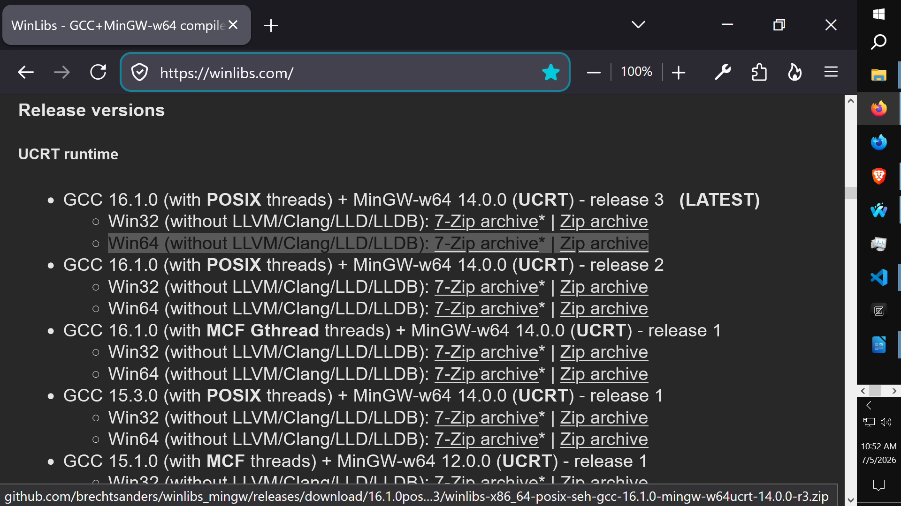
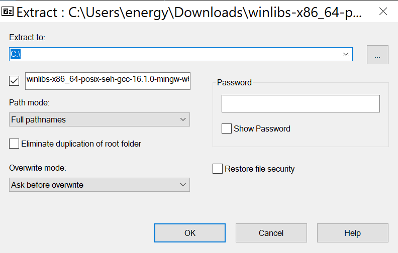
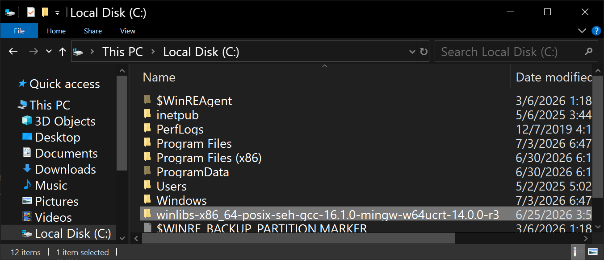
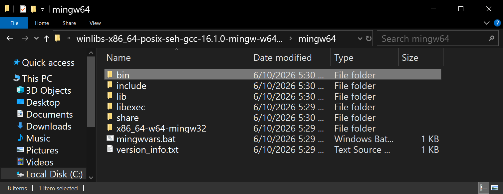
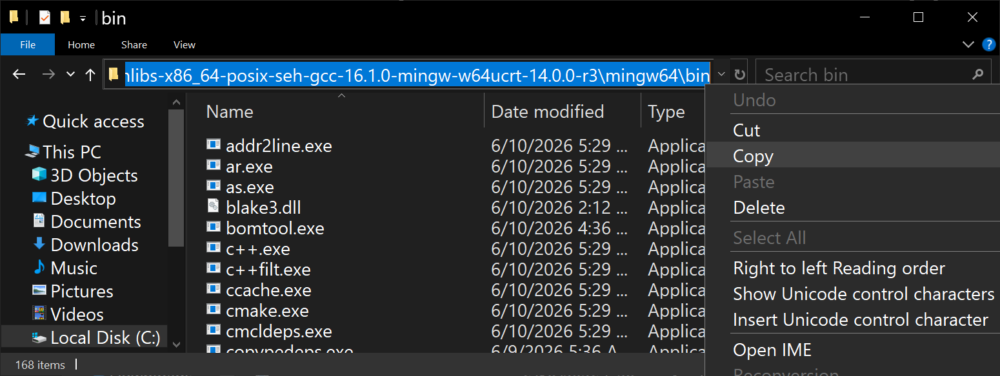
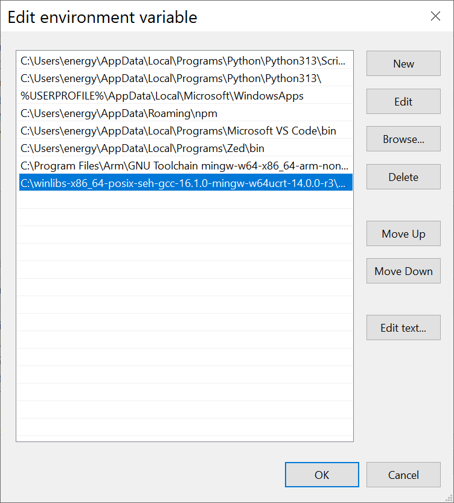

# Installing Compiler

1. Go to https://winlibs.com/

2. Scroll down and look for:
**GCC 16.1.0 (with POSIX threads) + MinGW-w64 14.0.0 (UCRT) - release 3   (LATEST)**

3. Click on the **Zip archive** file named: **Win64 (without LLVM/Clang/LLD/LLDB): 7-Zip archive\* | Zip archive**

---

## Extract to C:\

## Open C Drive Folder

## Open the folder named: **winlibs-x86_64-posix-seh-gcc-16.1.0-mingw-w64ucrt-14.0.0-r3**

---

## Open the bin folder

## With the bin Folder Open: Click the address bar and copy the address, which should look like: 
> C:\winlibs-x86_64-posix-seh-gcc-16.1.0-mingw-w64ucrt-14.0.0-r3\mingw64\bin

---

## Open Environment Variables
## Click Edit and Paste the Path to the Bin address

# Click OK on both dialogs, to Confirm the Environment Variable changes!

---

# Confirm by Opening Command Prompt and typing:
## **g++ --version**  
Press Enter

//----//

// Dedicated to God the Father  
// All Rights Reserved Christopher Andrew Topalian Copyright 2000-2026  
// https://github.com/ChristopherTopalian  
// https://github.com/ChristopherAndrewTopalian  
// https://sites.google.com/view/CollegeOfScripting  
// College of Scripting Music & Science

